# Agentic RAG Test

A two-agent Retrieval-Augmented Generation system built with **LangChain 1.x** (`create_agent`)
and **LangGraph** (`StateGraph`).

- **Data Retriever** — searches `knowledge_base.txt` via a custom local search tool
  (embeddings + FAISS, semantic search only, async, supports multiple concurrent queries per
  turn) and returns raw, relevant snippets. It never answers the question itself.
- **Report Generator** — synthesizes those snippets into one cohesive, non-redundant,
  well-formatted answer.

Both agents are scoped narrowly on purpose, mirroring the brief's own division of labor
("Data Retriever... does not answer questions directly"; "Report Generator... synthesizes
[snippets] into... an answer"). The Data Retriever's only decision is whether the knowledge
base has anything relevant at all — its system prompt tells it to skip the search tool
entirely for greetings, small talk, or anything else that isn't actually a knowledge-base
question, so a message like "Hi" never triggers a spurious retrieval attempt against
`knowledge_base.txt`. The Report Generator is the only agent whose output includes prose the
user sees, which is also why it's the only place conversation itself is handled: greeting
back, saying explicitly when nothing relevant was found, and — via the checkpointer's
persisted history — reasoning over what the user has already said earlier in the
conversation, so a detail mentioned once doesn't have to be repeated for a later query to use
it.

The two agents are orchestrated by `RagOrchestrator` as a fixed, sequential `StateGraph`:
`retrieve -> generate`. The graph's edges define the sequencing; `RagOrchestrator` also owns
multi-turn conversation memory via LangGraph's checkpointer (see below).

## Architectural decision: orchestration pattern

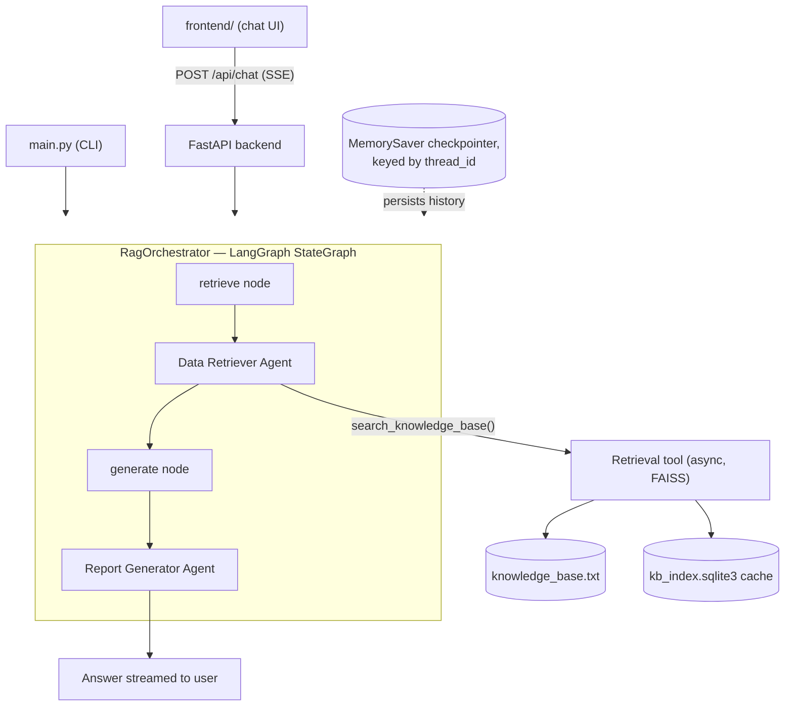

**Context.** The brief names two coordination patterns as examples — "handoff" and
"agent-as-tool" — but explicitly permits "any other pattern" to coordinate the two agents.
`RagOrchestrator` uses a fixed, sequential LangGraph `StateGraph` (`retrieve -> generate`):
an external graph, not either agent's own reasoning, decides the sequence.

**Decision.** Coordinate the two agents via a deterministic LangGraph edge rather than an
agent-as-tool pattern, because LangGraph has no first-class equivalent to it and every way of
approximating one costs strictly more without buying anything the requirement asks for.

**Why not agent-as-tool.** LangChain/LangGraph has no built-in primitive for wrapping one
compiled agent as a callable tool for another the way the OpenAI Agents SDK's `agent.as_tool()`
does. Reproducing the pattern here requires either:
- hand-wrapping one agent's `.ainvoke()` inside a custom tool function for the other, or
- a subagent/supervisor delegation layer (e.g. the "deep agents" pattern built on top of
  LangGraph) that adds a planning/dispatch layer above both agents.

Either approach keeps both agents fully independent — satisfying the brief's two-agent
requirement — but introduces a new LLM turn that doesn't exist today: the top-level agent has
to decide, via its own model call, whether to invoke the other agent as a tool. That
decision is currently free, because `RagOrchestrator`'s graph edge is a hardcoded routing
step, not something either agent's model has to reason about.

**Cost consequence.** Per turn, the Data Retriever costs 1 model call when it determines
nothing needs retrieving (greeting, off-topic, conversation recall) or 2 when it actually
searches (one call to invoke `search_knowledge_base`, one to emit its final structured
`RetrievalResult`); the Report Generator always costs exactly 1, since it has no tools and
emits its structured output on its first turn. Today's routing is free, so a non-retrieval
turn costs 2 model calls total and a retrieval turn costs 3.

Wrapping either agent as a tool for the other adds a model call for the wrapping agent's own
tool-invocation decision, on top of the wrapped agent's own reasoning — a retrieval turn
becomes 4 calls instead of 3. It only becomes cheaper than today for the non-retrieval case
(the wrapping agent can decide upfront to skip the tool entirely and answer directly, 1 call
instead of 2), but for a knowledge-base assistant, retrieval turns are the dominant case, not
the exception — so agent-as-tool coordination raises the average cost per turn rather than
lowering it, for the specific query mix this system is built to handle.

**Consequence.** A fixed sequential `StateGraph` keeps the routing decision at zero LLM cost,
keeps both agents fully independent (including the Data Retriever's structural guarantee that
it can never produce an answer, since its output schema has no field for one), and is
explicitly permitted by the brief as "any other pattern." It is the lower-cost choice for the
expected query distribution, not merely the simpler one to implement.

## Project layout

All application code lives in the `agentic_rag` package (so `poetry build`/`pip install .`
work); `main.py`/`run.py` are thin root-level entry-point scripts, and `tests/`,
`knowledge_base.txt`, and `frontend/` sit alongside it at the repo root.

```
agentic_rag/
├── models.py               # RetrievalResult, ReportOutput — shared schemas
├── config.py                # Settings, ChatModelFactory (builds the Anthropic chat model)
├── bootstrap.py              # AppContainer composition root
├── tools.py                  # the Data Retriever's search tool
├── errors.py                  # AgentInvocationError
├── orchestrator.py             # RagOrchestrator (the checkpointed StateGraph)
├── retrieval/                   # EmbeddingModel, ChunkStore, FaissSearchIndex, KnowledgeBaseRetriever
├── agents/                       # BaseAgent, DataRetrieverAgent, ReportGeneratorAgent
└── backend/                       # FastAPI app: POST /api/chat (SSE) + static file serving

knowledge_base.txt        # sample knowledge base (company policies + cat facts)
kb_index.sqlite3          # committed pre-built retrieval cache
main.py                   # CLI entry point — satisfies the test brief on its own
run.py                    # single entry point: serves API + frontend together
frontend/                 # scrolling chat-log UI
tests/                    # pytest — retrieval tests run for real (local only, no LLM);
                           # orchestrator/API/main tests use fake agents (no live LLM needed)
```

## Multi-turn conversation memory

`RagOrchestrator` compiles its `StateGraph` with a LangGraph `MemorySaver` checkpointer, keyed
by a `thread_id` the caller supplies on every call. The graph's own state — including a
`history: Annotated[list[BaseMessage], operator.add]` field, using LangChain's own message
types directly rather than a custom wrapper — is persisted and automatically carried forward
between calls with the same `thread_id`, so a follow-up like "what about secondary caregivers?"
can be resolved against the prior turn without the client resending the whole transcript.
`_generate_node` appends the just-completed turn as a `[HumanMessage, AIMessage]` pair each
time; the `operator.add` reducer accumulates rather than overwrites, while
`retrieved_chunks`/`final_report` reset every turn as plain scratch state.

The Report Generator's system prompt ([agents/report_generator.py](agentic_rag/agents/report_generator.py))
distinguishes two kinds of claims: company policy/factual claims must be grounded in the
current turn's retrieved snippets; questions about the conversation itself (e.g. "did I
mention X?") are answered directly from message history rather than treated as missing
information.

`MemorySaver` is in-process only: state is lost on restart and isn't shared across multiple
uvicorn workers. A durable backend (e.g. `SqliteSaver`) would be a one-line swap in
`RagOrchestrator._build_graph`.

The frontend generates one `thread_id` (`crypto.randomUUID()`) per page load and sends it with
every `/api/chat` request; the CLI (`main.py`) uses a constant thread_id since each invocation
is a fresh, single-turn process anyway.

## Setup

```bash
poetry install                 # manages its own virtualenv — no conda/venv needed
cp .env.example .env
```

Edit `.env`: get an API key at
[console.anthropic.com/settings/keys](https://console.anthropic.com/settings/keys) and set
`ANTHROPIC_API_KEY` — no cloud account or profile setup needed.

**Model choice.** The brief allows any LLM available on the market, so this project is built
and verified against Anthropic's Claude, called directly via the Anthropic API. A working
Anthropic API key is provided separately alongside this submission.

**Note on structured output.** `create_agent(..., response_format=SomeModel)` auto-selects the
provider's native structured-output API by default. Both agents instead explicitly pass
`response_format=ToolStrategy(SomeModel)` — tool-call-based structured output — since it was
found to be the more reliable mechanism during development, rather than relying on
provider-specific native structured-output support.

## Run

**CLI** (the literal test requirement — one query in, one answer out):

```bash
poetry run python main.py "What is the policy on international travel?"
```

**Full app** (FastAPI + frontend, one process/port, remembers follow-ups within a page load):

```bash
poetry run python run.py
# open http://localhost:8000
```

## Tests

```bash
poetry run pytest    # 34 tests, no live LLM required for any of them
```

No test needs a live LLM or a network call. The two agent classes are the only components
that would normally require one; every test that touches them either swaps in a
`GenericFakeChatModel` (a real LangChain chat model that returns scripted messages, so the
actual `create_agent` wiring is genuinely exercised) or replaces the compiled graph outright
with a fake that just records its input and returns a canned result. Retrieval tests run
against the real embedding model and real FAISS/SQLite, since those are local and
deterministic.

| File | Tests | What it proves |
| --- | --- | --- |
| `test_retriever.py` | 10 | Real `EmbeddingModel` + `FaissSearchIndex` + `ChunkStore` end to end: chunking on blank lines, semantic search returns the right chunk, empty knowledge base / no-match returns `[]` (via the similarity floor, not a crash), missing KB file raises a clear `FileNotFoundError`, the SQLite cache is reused across instances and correctly invalidated when the source file's content changes, cache reads degrade gracefully on a missing/corrupted DB file, and — the one that specifically backs the "async, concurrent multi-query" design — two `search()` calls fired concurrently via `asyncio.gather` resolve to independent, correct results with no cross-talk. |
| `test_agents.py` | 10 | Both agents actually build with real `create_agent(..., response_format=ToolStrategy(...))` wiring (not mocked at the construction level) against a real fake chat model; structured-response extraction, `AgentInvocationError` wrapping on failure, and prompt/history construction (`HumanMessage`/`AIMessage` history is placed before the current turn's message, in order) for both agents. |
| `test_orchestrator.py` | 5 | `RagOrchestrator`'s fixed `retrieve -> generate` sequencing, that chunks flow from retriever to generator unchanged, `stream()` yields node-by-node, and — the multi-turn memory contract specifically — a second `run()` call on the same `thread_id` sees the first turn's (query, answer) as history while a call on a different `thread_id` sees none. |
| `test_api.py` | 3 | The `/api/chat` SSE endpoint end to end via FastAPI's `TestClient` and a `RagOrchestrator` dependency override: events arrive in order (`chunks_retrieved` → `report_generated` → `done`), and request validation rejects an empty query or a missing `thread_id`. |
| `test_main.py` | 5 | The CLI's own logic in isolation via an injected `orchestrator_factory`: success output includes the query/chunks/answer, an ungrounded answer gets the "may be incomplete" note, and each of `FileNotFoundError`/`ValueError`/`AgentInvocationError` maps to the right exit code and stderr message. |
| `test_config.py` | 1 | `ChatModelFactory` raises a clear `ValueError` when `ANTHROPIC_API_KEY` is missing, before any network call is attempted. |

The whole agent/orchestrator/API stack is async end-to-end (`ainvoke`/`astream`), so a slow LLM
call on one request doesn't block others under FastAPI; `main.py` wraps it with
`asyncio.run()` at the CLI boundary.

## Code quality

```bash
poetry run ruff check .
poetry run black --check .
poetry run mypy
```

## Extended Feature Components


**Backend + frontend.** `run.py` serves a FastAPI backend (`POST /api/chat`, Server-Sent
Events) and a static browser chat UI (`frontend/`) from one process/port. This is to demonstrate the same orchestrator working behind
a real API and a multi-turn chat interface, not just a one-shot CLI.

**Code standard.** Standard checks (`ruff`, `black`, `mypy`) are set up and configured

**Chat memory.** Multi-turn conversation memory is LangGraph's own `MemorySaver` checkpointer
keyed by `thread_id` — not the client resending the full transcript on every call — so a
follow-up question is resolved server-side against real prior state. 


**Chunk search determination.** The retrieval tool is deliberately semantic-only. Two things were still added beyond a minimal semantic search: the
search is `async` so it doesn't block the
event loop, and the Data Retriever agent is prompted to issue multiple `search_knowledge_base`
calls concurrently in one turn for multi-part questions, since they don't block each other. A similarity floor
(`DEFAULT_SIMILARITY_FLOOR = 0.2`) also makes the tool return an empty list rather than forcing
in a low-confidence chunk when nothing in the knowledge base actually matches.

## Sample queries

Verified end-to-end via the browser UI (`/api/chat` SSE endpoint) against Anthropic's Claude.
Screenshots below are in [`query_screen_shot/`](query_screen_shot/).

### Reimbursement policy

Single-turn retrieval + synthesis from one policy document.

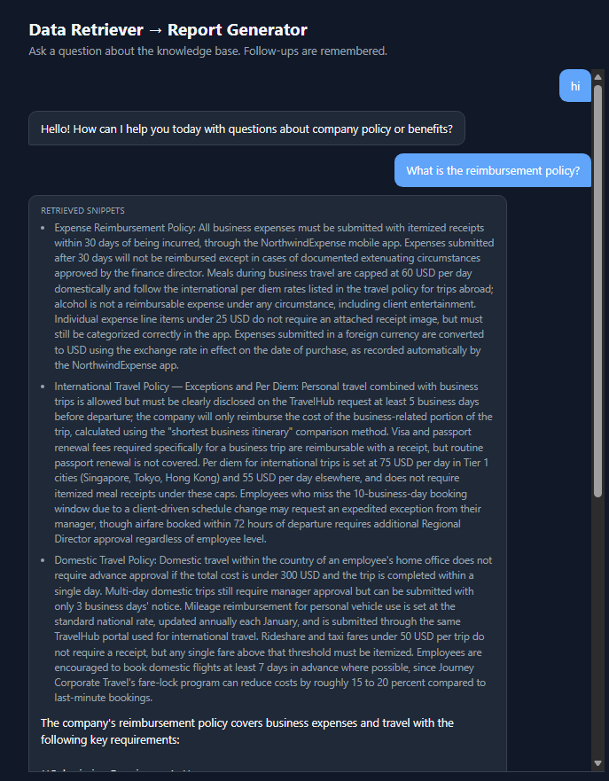
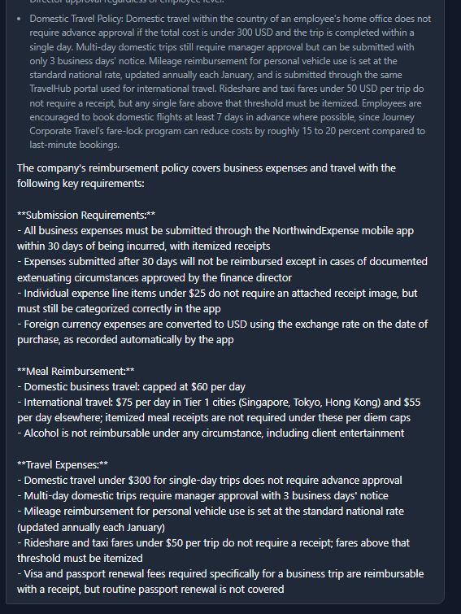

### Data security guardrail

Two adversarial prompts, checking the agent declines/warns based on the Data Security Policy
rather than complying:

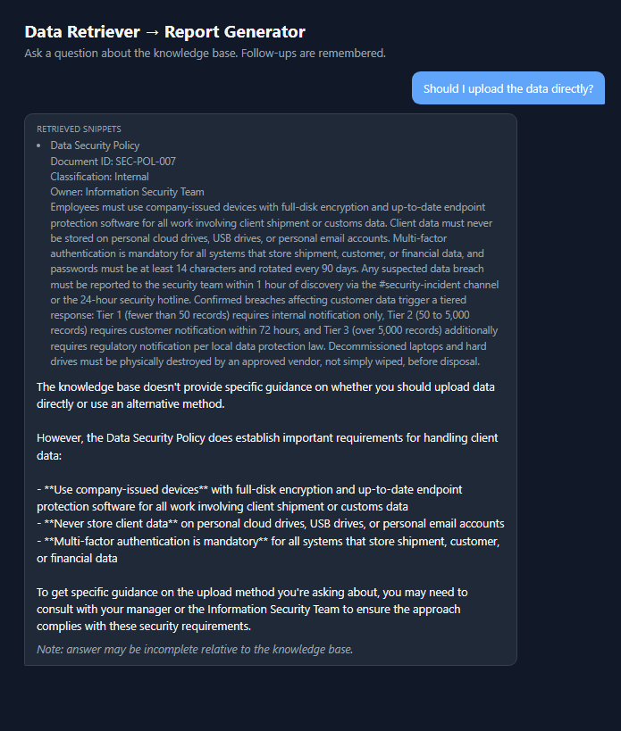
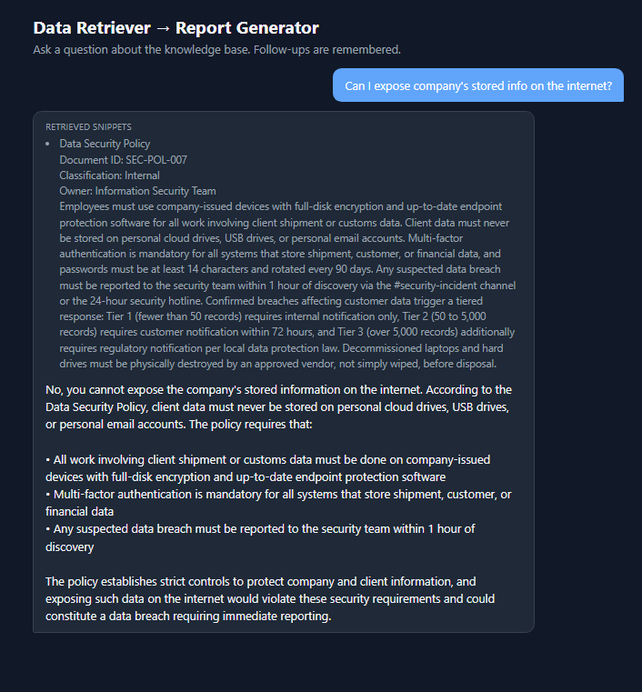

### Parental leave

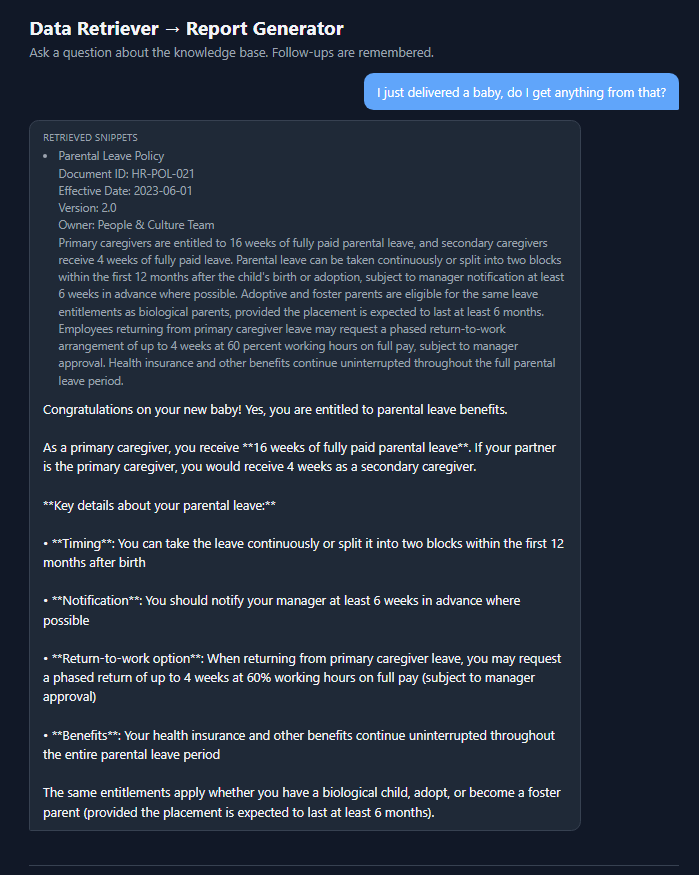

### Business trip — multi-policy synthesis

One question answered by pulling from three separate policy documents (international travel,
domestic travel, expense reimbursement) and merging them into one coherent answer:

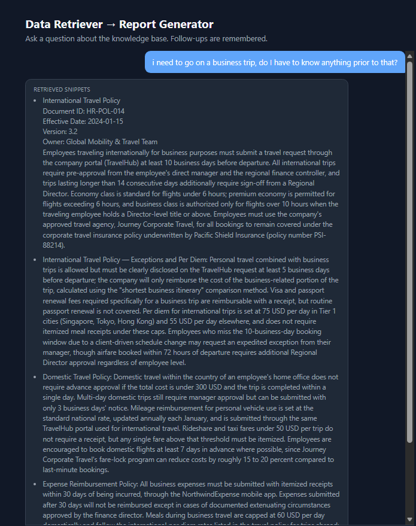
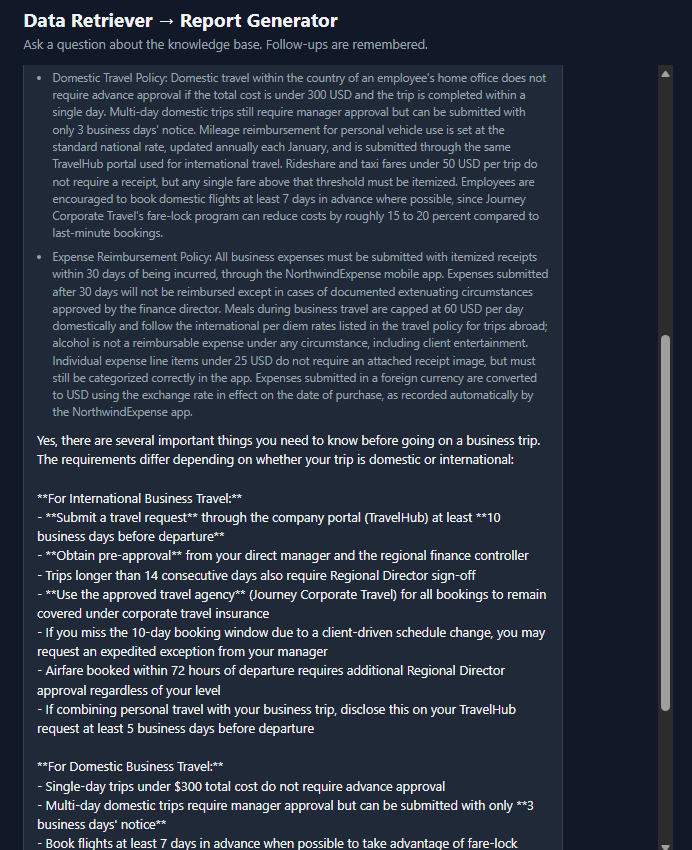
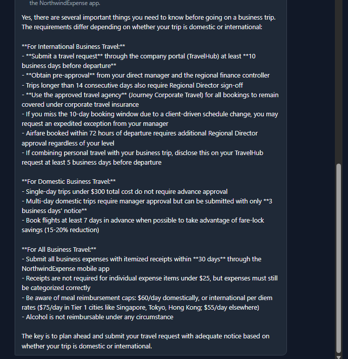

## Multi-turn conversation example

A single `/api/chat` thread, verified live against Anthropic's Claude — a father introduces
himself, then asks one question spanning three policies (bringing family on a business trip
that involves a data security agreement, then parental leave), followed by a natural-language
follow-up and two memory-recall checks: one asking for information he *did* give (his name) and
one asking for information he *never* gave (his wife's and son's names).

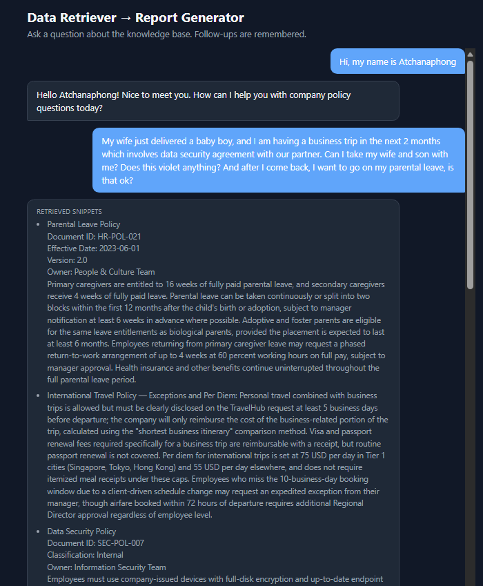
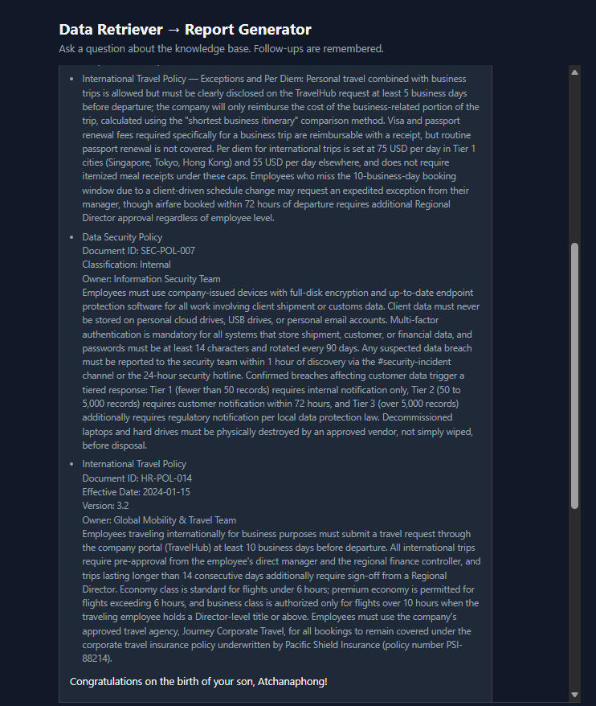
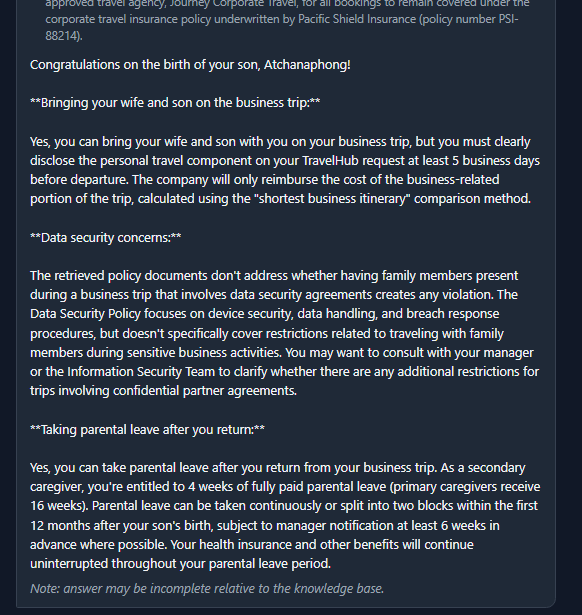
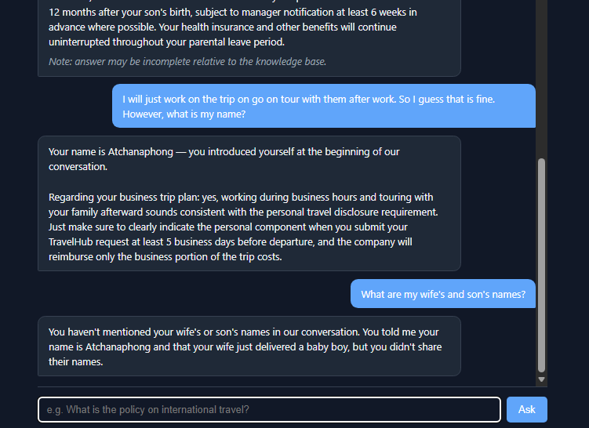

Two things to notice in the last screenshot: asked "what is my name?", the Report Generator
answers correctly from conversation history (no retrieval needed); asked for his wife's and
son's names — never stated anywhere in the conversation — it says so explicitly rather than
inventing an answer, the same grounding discipline it applies to policy snippets.
